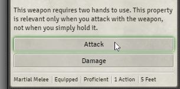
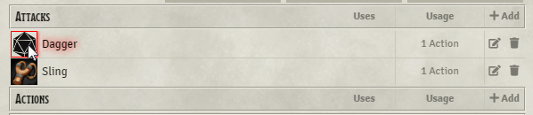

# Minor UX tweaks for FoundryVTT

Tweaks some buttons to show a red or green box shadow when Ctrl or Alt is pressed.
Probably only useful when using it together with the great [QoL module](https://gitlab.com/tposney/minor-qol).

Currently it affects the following:

Chat buttons:

Inventory buttons:

## Installing

1. Copy the manifest url: <https://raw.githubusercontent.com/didii/foundryvtt-minor-ux/master/module.json>
2. Click on install module in Foundry and paste the manifest url in the input field

